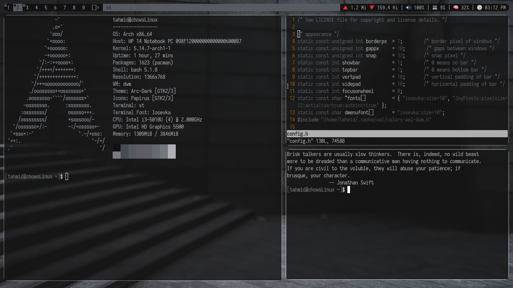

## Introduction
This is my fork of (Slstatus)[https://tools.suckless.org/slstatus].

## Screenshot


I am using [jonaburg-picom](https://github.com/jonaburg/picom) here.

## Installation
```
git clone https://github.com/TahmidChow06/slstatus ~/.config/slstatus
sudo make install
```
It will clone the config in ~/.config/slstatus. and install slstatus.

# After Installing
The first two are the netspeed. For this, you need to know your 
wireless interface name. By default it is set it to wlp9s0.

To know your wireless interface name run this command:
```
ifconfig | head -n10 | tail -n1 | awk '{print $1}' | tr ':' ' '
```
Now go to config.h and change all wlp9s0 two your wireless interface.
and then recompile the code with `sudo make install`.
and restart slstatus.

```
killall slstatus ; slstatus
```

# Modules

Modules are network up and down, volume, CPU, RAM and Time respectively.
